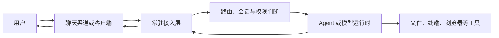
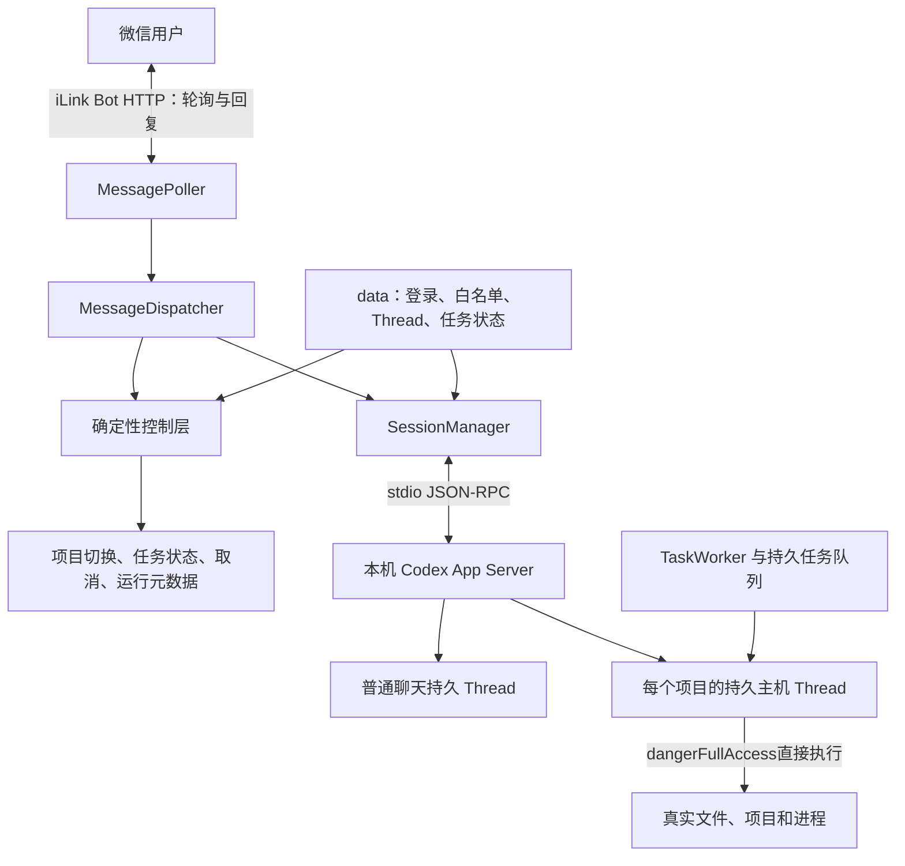
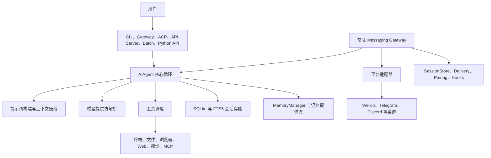
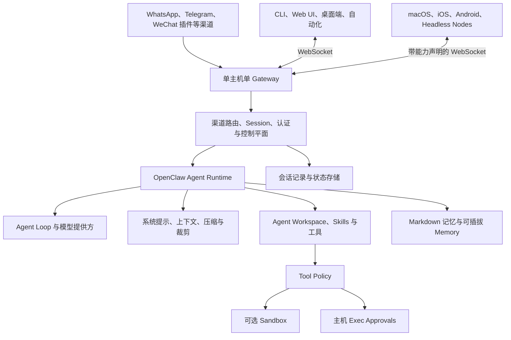

# wxbot、Hermes Agent 与 OpenClaw 架构对比

更新时间：2026-07-18

## 1. 先看结论

三者都能把聊天消息交给 AI 处理，但定位不同：

- **wxbot**：面向单个使用者的微信主机 Agent入口。它复用本机已经登录的 Codex App Server，以长期主机 Thread直接操作当前 Windows账号有权访问的资源，不自己实现通用 Agent Runtime。
- **Hermes Agent**：以 Python `AIAgent` 为核心的通用 Agent 平台。CLI、消息 Gateway、API Server 等入口共享同一套模型、工具、会话和记忆能力。
- **OpenClaw**：以常驻 Gateway 为控制平面、自带 Agent Runtime 的完整个人 Agent 平台。它统一承载多渠道、客户端、节点、会话、工作区、记忆、工具策略和沙箱。

wxbot当前选择吸收 Hermes的直接工具执行模式：保留专用微信入口和 Codex Runtime，但取消隔离补丁审批。它不是完整复制 Hermes或 OpenClaw，仍不实现多渠道、模型提供方、插件市场、通用记忆和完整 Agent Runtime。

## 2. 对比范围与证据

- wxbot 依据本仓库 2026-07-18 的代码和文档整理。
- Hermes Agent 与 OpenClaw 依据同日可访问的官方文档和官方仓库整理。
- 文中的“官方实现”表示可由官方资料直接确认；“本文归纳”表示根据组件职责作出的架构总结，不代表项目官方原话。
- Hermes Agent 与 OpenClaw 更新较快，版本升级后应重新核对官方资料。

## 3. 共同的抽象链路

从用户视角看，三者都可以抽象为以下链路：

真正的差异在中间三层：谁拥有 Agent Runtime、会话如何持久化、模型能直接做什么，以及高风险动作由谁批准。

## 4. wxbot 架构

### 4.1 定位

wxbot 是“微信 iLink 接入＋本地 Codex主机控制”的专用桥接程序。它只服务首位配对的白名单用户，目标是让使用者在手机微信中控制当前 Windows账号有权访问的文件、项目和进程。常用项目列表只是快捷入口，不构成权限边界。

### 4.2 组件图

### 4.3 一条消息如何处理

1. `MessagePoller` 长轮询 iLink，成功处理后才推进游标，并按消息 ID 去重。
2. `MessageDispatcher` 立即接收下一条消息；任务查询、取消等即时控制不必等待前一个 AI 请求结束。
3. 确定性控制层优先处理项目切换、任务状态、取消、清理上下文、模型和 Token信息等明确操作。
4. 普通聊天或项目问答进入对应的持久 Codex Thread；Thread使用真实工作目录和主机级权限。
5. 明确执行请求进入持久任务队列，由 `TaskWorker`在原长期 Thread中直接修改、运行命令和验证。
6. 成功结果直接通知微信；失败保存脱敏阶段与原因。“为什么失败”“继续处理”继续关联原任务上下文。

### 4.4 状态与边界

| 状态 | 保存位置 | 作用 |
|---|---|---|
| iLink 登录与游标 | `data/session.json` | 恢复微信会话和消息拉取位置 |
| 白名单、消息去重、最近对话 | `data/auto_reply.json` | 限制自动回复对象并防止重复处理 |
| Codex Thread 映射 | `data/thread_sessions.json` | 重启后恢复普通聊天及各项目上下文 |
| 长任务状态 | `data/tasks.json` | 查询、取消、重启恢复和结果补发 |
| 入站消息队列 | `data/inbox.json` | 重启恢复尚未开始的消息并对终态记录脱敏 |
| 任务 checkpoint | `data/checkpoints/` | 保存任务前后文件状态，用于独立查看差异和确认恢复 |

wxbot当前的关键特点是“单用户主机信任”：微信白名单用户获得与运行 wxbot的 Windows账号近似的文件和命令能力。确定性代码仍负责白名单、任务状态、取消、checkpoint、冲突检测和敏感信息脱敏；普通项目依赖、Git提交、当前分支普通推送和少量明确点名文件操作直接执行，批量破坏、凭证、CI/CD、数据库迁移、全局依赖、系统配置、生产发布和 Git改写历史继续要求具体确认，但不再审批整份普通补丁。

## 5. Hermes Agent 架构

### 5.1 定位

Hermes Agent 是通用 Agent 平台，不只是消息转发器。官方架构以 `AIAgent` 为核心，CLI、Gateway、ACP、批处理、API Server 和 Python Library 都是它的入口。

### 5.2 组件图

### 5.3 消息 Gateway 的职责

Hermes Gateway 是长期运行的多渠道接入进程。各平台适配器将不同渠道消息标准化为统一 `MessageEvent`，再交给 Gateway 路由到 Agent。Gateway 还负责：

- 用 SessionStore 将渠道会话映射为 Agent 会话；
- 用 Delivery 发送最终回复；
- 用 Pairing 控制私聊授权；
- 通过生命周期 Hooks 处理启动、Agent 步骤、会话结束和重置；
- 在会话结束或重置时刷新记忆。

Hermes 的微信适配器同样可通过 iLink Bot API 接入个人微信，但 iLink 只是众多渠道适配器之一；真正执行推理和工具调用的是 Hermes 自己的 `AIAgent`。

### 5.4 与 wxbot 的核心差异

Hermes 直接拥有模型抽象、Agent 循环、工具系统、压缩、会话库和记忆系统。wxbot 则把这些能力交给本机 Codex App Server，只在外部增加微信接入、项目路由、异步任务和风险确认。因此 Hermes 更通用，wxbot 更容易保持与本机 Codex 的行为和登录状态一致。

## 6. OpenClaw 架构

### 6.1 定位

OpenClaw 是自托管的个人 Agent 平台。官方架构由单个长期运行的 Gateway 统一拥有消息渠道；CLI、Web UI、桌面应用、自动化和远端 Nodes 通过 WebSocket 连接 Gateway。Gateway 再调度 OpenClaw 内置 Agent Runtime。

### 6.2 组件图

### 6.3 核心机制

- **Gateway**：统一持有消息渠道和控制连接，是整个平台的常驻控制平面。
- **Session**：消息根据私聊、群组、房间、定时任务或 Webhook 路由到不同会话；多用户场景可按渠道和发送者隔离私聊。
- **Agent Runtime**：内置 Agent 循环、模型选择、提示词、Skills、工具和会话持久化契约。
- **Context**：每轮重新组装系统提示、工作区文件、会话历史、工具定义和结果；支持上下文查看、压缩和旧工具结果裁剪。
- **Memory**：默认用工作区中的 `MEMORY.md` 与按日期组织的 Markdown 保存长期和日常记忆，并提供搜索工具；也支持可插拔记忆后端。
- **权限**：工具策略决定工具是否可用；可选沙箱限制文件和进程访问；需要在真实主机执行命令时，还可叠加 allowlist 和人工审批。

WeChat 在 OpenClaw 中属于外部渠道插件，通过腾讯 iLink Bot 二维码接入私聊。它接入的是 OpenClaw Gateway 和 Agent Runtime，而不是本机 Codex 的某个现有项目会话。

## 7. 横向对比

| 维度 | wxbot | Hermes Agent | OpenClaw |
|---|---|---|---|
| 核心定位 | 微信远程控制本机 Codex 项目 | 通用 Python Agent 平台 | 完整自托管个人 Agent 平台 |
| 常驻入口 | wxbot 自动回复进程 | Messaging Gateway | Gateway 控制平面 |
| Agent Runtime | 复用 Codex App Server | 自有 `AIAgent` | 自有 Agent Runtime |
| 微信接入 | 内置 iLink，当前唯一主要渠道 | Gateway 的 Weixin 适配器 | 外部 WeChat iLink 插件 |
| 多渠道 | 当前不追求 | 支持多平台适配器 | 核心渠道加插件体系 |
| 模型体系 | 使用本机 Codex 当前模型和登录状态 | 多模型提供方 | 多模型提供方 |
| 会话 | 普通聊天和每个项目各自持久 Thread | Gateway Session 映射到 Agent Session | 按渠道、用户和场景路由 Session |
| 长期记忆 | 主要依赖 Codex Thread；本地只保留有限降级历史 | SQLite 会话加 Memory Provider | Markdown 记忆、搜索及可插拔后端 |
| 项目资料 | 直接读取当前 Windows账号可访问的真实文件系统 | Agent 工作目录和文件工具 | Agent Workspace 和注入文件 |
| 写入方式 | 持久 Codex Thread以主机权限直接执行，任务前后保存 checkpoint | Agent 工具和平台权限机制，自动文件系统 checkpoint | Tool Policy、Sandbox、Exec Approval |
| 高风险边界 | 唯一白名单、Windows账号权限及具体高风险动作确认 | 配对、工具确认和可选隔离机制 | 渠道授权、工具策略、沙箱和主机命令审批 |
| 复杂度 | 最低，服务单一目标 | 中高，能力完整且可嵌入 | 最高，平台、渠道和节点能力最完整 |
| 最适合 | 已有 Codex，希望手机控制本机项目 | 希望使用统一通用 Agent 内核 | 希望部署完整个人 Agent 基础设施 |

## 8. wxbot 如何借鉴而不复制另外两者

### 8.1 不重复建设 Agent Runtime

本项目的前提是本机已有 Codex，并希望沿用 Codex 登录状态、模型能力、项目规则和 Thread。重新实现模型提供方、Agent 循环、工具系统、压缩和记忆，会产生两套行为和配置，反而削弱这个优势。

### 8.2 采用 Hermes式直接执行，但保留专用边界

wxbot已取消普通修改的隔离补丁审批，让长期 Codex Thread直接操作真实文件和命令，减少手机端任务与桌面端任务的能力差异。它仍保留唯一白名单、任务状态、取消、失败脱敏和具体高风险动作确认；这些是微信远程入口需要的专用边界，不必复制 Hermes的全部 Gateway能力。

### 8.3 避免引入无实际需求的平台复杂度

当前没有多用户、多 Agent、多设备节点和大量消息渠道的明确需求。为这些能力引入插件生命周期、通用路由协议和独立记忆基础设施，会增加维护成本，但不会改善当前微信控制 Codex 的核心体验。

## 9. 值得借鉴的设计

| 来源 | 值得借鉴 | wxbot 当前状态或建议 |
|---|---|---|
| Hermes | 渠道适配器与统一消息事件分离 | 当前 iLink 与处理层已分离；增加其他渠道时再抽象通用适配接口 |
| Hermes | Gateway 生命周期 Hooks | 暂不引入通用 Hook 系统；只为真实出现的启动、任务和会话事件增加明确处理 |
| Hermes | 会话与记忆分离 | 继续区分 Codex Thread、任务状态和有限降级历史；项目事实按需读取真实文件系统 |
| OpenClaw | `/status`、上下文和 Token 可观测性 | wxbot 已接入 App Server运行元数据；继续只展示协议真实提供的字段 |
| OpenClaw | 会话路由与多用户隔离 | 当前单白名单足够；扩展用户前必须先设计每用户会话和权限边界 |
| OpenClaw | Tool Policy、Sandbox、Approval 分层 | wxbot采用主机级直接执行；删除、凭证、CI/CD、数据库、系统配置和发布类动作仍需具体确认 |
| OpenClaw | 压缩前记忆刷新与可搜索长期记忆 | 只有真实长对话证明 Thread 压缩不足时再引入，不提前复制完整记忆系统 |

## 10. 选择建议

- 只想从手机微信控制本机已有 Codex 项目：继续使用 wxbot。
- 想把同一个通用 Agent 内核嵌入 CLI、API、批处理和多种消息渠道：评估 Hermes Agent。
- 想部署带多渠道、控制 UI、设备节点、工作区、记忆和权限体系的完整个人 Agent 平台：评估 OpenClaw。
- 如果未来 wxbot 出现多渠道、多用户或多设备的刚性需求，应重新评估继续扩展 wxbot，还是迁移到通用平台；不要在需求出现前复制整个平台。

## 11. 官方资料

### Hermes Agent

- [Hermes Agent Architecture](https://hermes-agent.nousresearch.com/docs/developer-guide/architecture/)
- [Hermes Gateway Internals](https://github.com/NousResearch/hermes-agent/blob/main/website/docs/developer-guide/gateway-internals.md)
- [Hermes Agent 官方仓库](https://github.com/nousresearch/hermes-agent)

### OpenClaw

- [Gateway Architecture](https://docs.openclaw.ai/architecture)
- [Agent Runtime Architecture](https://docs.openclaw.ai/agent-runtime-architecture)
- [Channels](https://docs.openclaw.ai/channels)
- [Session Management](https://docs.openclaw.ai/session)
- [Context](https://docs.openclaw.ai/concepts/context)
- [Memory Overview](https://docs.openclaw.ai/concepts/memory)
- [Sandboxing](https://docs.openclaw.ai/gateway/sandboxing)
- [Exec Approvals](https://docs.openclaw.ai/tools/exec-approvals)
