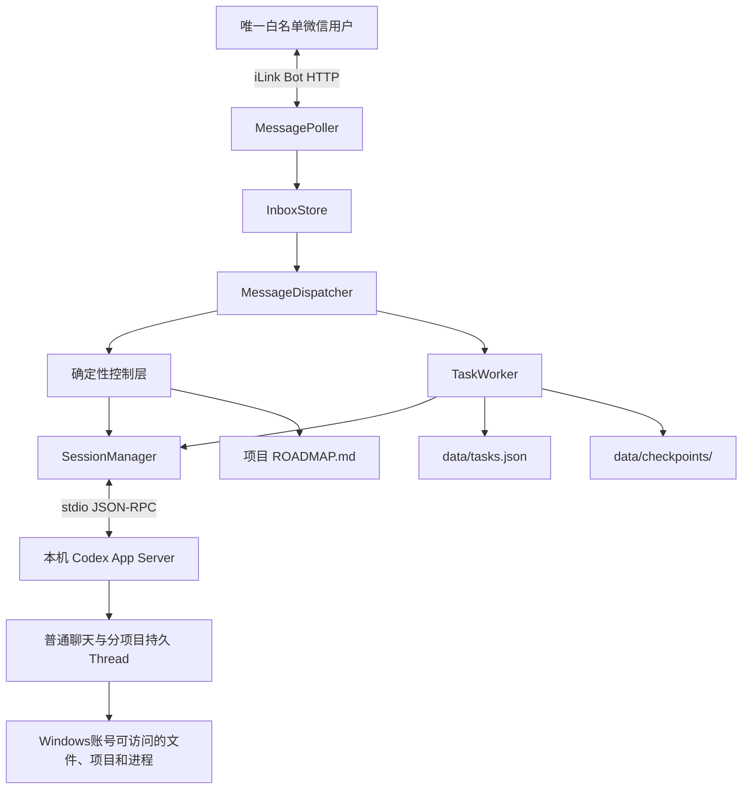

# wxbot Codex App Server 当前架构

更新时间：2026-07-24

## 1. 架构定位

wxbot是唯一白名单微信用户连接本机 Codex的远程入口。微信 iLink只负责消息收发；咨询、项目问答和明确执行请求都进入本机 Codex App Server中的持久 Thread，并复用当前 Windows用户已有的 Codex登录状态。

当前实现采用主机级直接执行：

- 普通聊天和每个项目分别维护长期 Thread。
- 明确执行请求继续使用原项目 Thread和真实工作目录。
- Thread使用 `danger-full-access`，Turn使用 `dangerFullAccess`与 `never`。
- 普通修改不创建隔离快照、临时任务 Thread、审批码或待审批补丁。
- 后台 Worker只负责异步调度、取消、状态持久化和完成通知。
- 文件 checkpoint用于查看差异和安全恢复，不是写入前审批。

已停用方案及迁移阶段见 [App Server历史迁移记录](APP_SERVER_MIGRATION_HISTORY.md)。

## 2. 总体结构



App Server使用本地 `stdio://`通信，不开放网络端口，不复制 `auth.json`，也不修改 `CODEX_HOME`。

## 3. 组件职责

### 3.1 微信协议层

- `ILinkClient`负责扫码登录、长轮询、收取消息和发送回复。
- 入站消息必须保留对应的 `context_token`。
- `client_id`从入站消息稳定派生，用于服务端发送去重。
- `get_updates_buf`只在消息成功进入持久处理链后推进。
- 会话错误 `-14`停止轮询并要求重新扫码。

### 3.2 持久收件箱与调度

- `InboxStore`在处理前持久化消息，避免进程退出造成未开始任务丢失。
- `MessageDispatcher`让控制查询绕过被长任务占用的项目队列。
- 同一项目的 AI消息顺序执行，不同项目之间保持独立状态。
- 重启时只恢复尚未开始的消息；已开始但结果不确定的消息不自动重放。

### 3.3 确定性控制层

以下操作不进入模型猜测：

- 项目发现、切换和当前项目查询。
- `ROADMAP.md`进度、当前任务、下一步和阻塞查询。
- Thread列表、搜索、预览、切换和运行元数据查询。
- 后台任务状态、失败原因、取消和完成通知。
- checkpoint差异、文件详情、恢复预览与确认恢复。
- 清空上下文和 AI状态重置。

正式进度每次从当前项目根目录的 `ROADMAP.md`重新读取，旧 Thread上下文不得覆盖磁盘事实。

### 3.4 Session与 App Server

- 普通聊天使用独立 Session。
- 每个项目使用独立持久 Session，切换项目不删除旧 Thread。
- Thread映射保存在 `data/thread_sessions.json`，不保存消息正文或凭证。
- Thread启动和恢复都覆盖当前工作目录与权限策略。
- 只有 App Server明确报告 rollout不存在或损坏时才移除旧映射并新建。
- 持久主 Thread使用用户可见来源和稳定名称，使 Codex CLI与桌面端能够发现和恢复。

### 3.5 后台任务

修改任务由 `TaskWorker`异步执行，但仍复用原项目 Thread：

1. 在 `data/tasks.json`创建 `queued`任务。
2. Worker取出后标记为 `running`。
3. 原项目 Thread直接修改真实文件并运行验证。
4. 结束后记录 `completed`、`failed`或 `cancelled`。
5. 微信端收到一次完成通知；未通知结果在下一条白名单消息到达时补发。

执行状态与验收状态分开：

- `status`记录 `queued`、`running`、`completed`、`failed`或 `cancelled`。
- `acceptance_status`记录 `not_required`、`pending`或 `accepted`。
- 执行成功但 `ROADMAP.md`仍要求外部确认时标记为 `pending`。
- 用户明确确认后，将对应待验收任务更新为 `accepted`。
- 不允许使用后来切换的当前主任务状态反向推断旧任务的验收结果。

“当前任务怎么样了”在任务运行时返回实时执行状态；执行结束后读取 `ROADMAP.md`。“刚才的任务怎么样了”返回最近一次后台任务及其最新验收状态。

### 3.6 Checkpoint

每个执行任务在修改前后记录普通项目文件状态：

- 存放在 `data/checkpoints/<task_id>/`。
- 跳过 `.git`、依赖、构建产物、凭证、符号链接和超限文件。
- 查看差异由程序计算，不让模型猜测。
- 恢复必须先预览并再次确认。
- 后续无冲突修改通过逐文件三方比较保留；真正冲突的文件单独跳过。
- 不使用整仓覆盖或回滚命令。

## 4. 消息处理链路

### 4.1 普通问答

```text
微信原文
→ 白名单与去重
→ 当前 Session
→ Codex App Server Turn
→ 结果文本
→ 使用原 context_token回复
```

写入 Codex Thread的用户消息必须保持微信原文，不拼接权限包装、意图分类、历史 JSON或结果格式要求。长期规则由 `AGENTS.md`和 Thread基础指令提供。

### 4.2 项目执行

```text
微信明确执行请求
→ 项目 Thread判断为 change
→ TaskStore持久化
→ TaskWorker调用原长期 Thread
→ 真实工作区修改与验证
→ checkpoint差异
→ 脱敏完成报告
→ 微信通知
```

完成报告只保留实际文件、验证结论、测试数量与一次总耗时、提交和推送状态，不展示底层命令或完整日志。

### 4.3 进度与任务查询

- 项目进度类问题读取 `ROADMAP.md`。
- 运行中的后台任务查询读取 `data/tasks.json`。
- 当前后台任务正常结束且通知已送达后，“当前任务”回到项目进度语义；失败、取消或完成通知尚未确认发送时，仍优先返回该后台任务结果。
- “刚才／这个任务”始终指最近一次后台执行记录。
- 超时、App Server进程退出或通信中断、服务重启中断、用户取消均使用固定且脱敏的原因文案；失败结果统一提示真实文件可能已有部分修改。
- 完成通知发送失败时保留 `notification_pending`，重启后继续可查询并在下一条微信消息到达时重试；状态查询会明确提示通知尚未确认发送。
- 已验收任务不再重复历史报告中的旧待确认结论。

## 5. 权限与安全边界

唯一白名单用户可以让当前长期 Thread访问该 Windows账号有权访问的目录、项目和进程。常规读取、搜索、修改、新增、项目内依赖、测试、lint、构建、诊断、普通 Git提交、当前分支普通推送，以及少量明确点名普通文件的删除或移动可以直接执行；写任务继续自动创建 checkpoint。

以下操作仍必须针对具体动作暂停确认：

- 批量或递归删除目录、清空数据。
- 修改 `.env`、凭证或密钥。
- CI/CD配置。
- 数据库迁移或批量数据删除。
- 全局依赖或系统配置。
- 生产部署、公开发布或删除远端资源。
- force push、rebase、改写历史或覆盖工作区。

真实 Token、二维码、用户 ID、消息正文和 `context_token`不得进入普通日志、测试夹具或仓库。

## 6. 持久状态

| 路径 | 作用 | 是否提交 |
|---|---|---|
| `data/session.json` | 微信登录状态、服务地址和游标 | 否 |
| `data/auto_reply.json` | 白名单、去重和降级历史 | 否 |
| `data/thread_sessions.json` | Session与 Thread映射 | 否 |
| `data/tasks.json` | 后台任务执行状态、验收状态和脱敏结果 | 否 |
| `data/inbox.json` | 消息处理状态 | 否 |
| `data/checkpoints/` | 任务前后文件状态和差异 | 否 |
| `ROADMAP.md` | 项目正式进度、验收条件和下一步 | 是 |

## 7. 故障与恢复

- App Server冷启动允许最多约 30 秒健康等待。
- 短暂恢复失败保留原 Thread ID，不盲目创建新 Thread。
- 运行中任务遇到服务重启会标记失败，并提示真实文件可能已部分修改。
- App Server超时、进程退出和通信中断均持久化为失败状态，自然语言查询不依赖模型猜测。
- 微信完成通知发送失败不会改写任务执行结果，只保留待通知标记并在后续消息时重试。
- 取消只阻止后续执行，不自动回滚已写入文件。
- 模型超时、拒答、空回复或超长回复不发送兜底消息。
- 轮询网络错误按退避重试；会话失效停止轮询。

## 8. 当前维护边界

以下代码可能因旧测试或数据兼容仍然存在，但不属于当前执行链：

- 脱敏项目快照。
- 隔离任务工作区。
- unified diff补丁生成与审批码。
- `git apply`补丁应用。
- `waiting_approval`旧状态。
- 逐消息 `codex exec`默认路径。

维护当前功能时不得根据历史文档重新接入这些模块。确需删除兼容代码时，应另立迁移任务并验证旧本地状态的读取影响。

## 9. 验证要求

- 自动化测试覆盖 App Server协议、Thread恢复、消息持久化、任务状态、取消、checkpoint、权限边界和进度路由。
- 集成测试默认使用本地 mock server。
- 真实微信验收覆盖消息收发、长期 Thread、主机级执行、任务查询、人工验收同步和重启恢复。
- 默认命令：

```powershell
.\.venv\Scripts\python.exe -m unittest discover -s tests -v
```

相关文档：

- [技术设计](TECHNICAL_DESIGN.md)
- [Agent架构对比](AGENT_ARCHITECTURE_COMPARISON.md)
- [历史迁移记录](APP_SERVER_MIGRATION_HISTORY.md)
