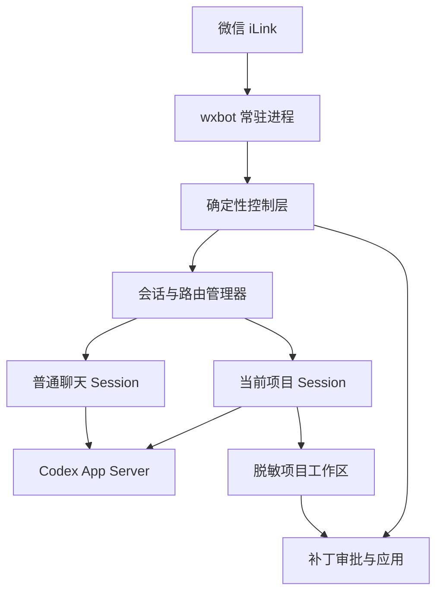

# wxbot Codex App Server 历史迁移记录

更新时间：2026-07-24

本文记录从逐消息 `codex exec`迁移到“只读项目 Thread＋隔离补丁审批”的旧方案，以及该方案当时的实施阶段和验收结果。它只用于追溯设计演进，不代表当前运行架构。

当前有效设计见 [Codex App Server 当前架构](APP_SERVER_ARCHITECTURE.md)。旧快照、任务工作区、审批码和补丁应用流程不得作为新功能的实现依据。下文保留原文编号，方便历史提交和旧文档引用继续定位。

## 2. 当时需要解决的问题

当前实现存在四个结构性问题：

1. 每条普通聊天或复杂项目问题都会启动新的 Codex CLI 进程，重复加载认证、配置和运行时。
2. 普通聊天和项目问答共用一份简化历史，项目切换只能通过清空历史避免串话。
3. 项目路由依赖“项目、进展、这个、它、继续”等关键词；新表达未命中时会错误进入普通聊天。
4. 快速查询直接拼接文档，虽然速度快，但缺少自然语言理解和稳定表达。

## 3. 目标与非目标

### 3.1 目标

- wxbot 后台运行期间只启动一个 Codex App Server 进程。
- 普通聊天与每个项目使用独立 Thread，互不共享上下文。
- 切换项目只切换活动 Session，不清空旧项目上下文。
- 项目模式下所有自然语言问题默认属于当前项目，规则未覆盖时仍进入当前项目 Thread。
- 项目事实从实时刷新的脱敏工作区读取，Session 只保存对话关系，不作为项目现状来源。
- 项目模式允许读取完整非敏感文本文件，并直接运行既有测试、lint、构建和只读诊断。
- 普通文件写入先形成待审批任务，白名单用户在微信确认后才执行；高风险操作继续强制拦截。
- 清空上下文只清空当前活动 Session，保留白名单、消息去重、登录状态和当前项目。

### 3.2 非目标

- 不实现 OpenClaw 的多消息平台、插件市场、多 Agent 调度、管理后台和定时任务。
- 不开放 App Server 网络端口。
- 不让 Codex直接访问未经筛选的真实项目。
- 不在第一阶段依赖 App Server 的实验性 `dynamicTools`。
- 不让普通聊天或项目问答退回逐消息 `codex exec`。

## 4. 总体架构



### 4.1 微信 iLink 层

保持现有职责：扫码登录、长轮询、消息去重、游标推进、`context_token` 回复和会话错误处理。该层不理解项目语义，也不访问项目。

### 4.2 wxbot 常驻进程

在现有后台轮询之外增加 App Server 生命周期管理：启动、初始化、健康检查、请求关联、超时、中断和关闭。App Server异常退出时，当前请求失败且不发送兜底消息；恢复成功后才接受下一条模型请求。

### 4.3 确定性控制层

只处理会改变本地状态、权限或真实文件的操作：

- 列出、切换和退出项目。
- 清空当前上下文。
- 查看、批准和拒绝补丁。
- 查看、确认、取消和查询远程任务。
- 白名单、审批码、路径、项目指纹和 `git apply --check` 校验。

控制层不得通过模型决定操作是否执行。自然语言项目问答不在该层按关键词穷举。

### 4.4 会话与路由管理器

路由依据持久化状态，而不是上一条回复样式：

```json
{
  "conversation_mode": "project",
  "current_project": "wxbot"
}
```

- `chat` 模式：消息进入普通聊天 Session。
- `project` 模式：所有非控制消息进入当前项目 Session。
- 快速读取即使未识别，也只能退回当前项目 Session，不能退回普通聊天。

### 4.5 Codex App Server

使用长期运行的本地子进程：

```powershell
codex app-server --listen stdio://
```

客户端通过逐行 JSON-RPC 通信，至少支持：

- 初始化与能力协商。
- `thread/start` 创建 Thread。
- `turn/start` 发送用户消息。
- 收集 `item/completed` 与 Turn完成事件中的最终助手文本。
- 超时后中断 Turn。
- 关闭 App Server。

普通聊天和项目主 Thread均使用 `ephemeral: false`，使 Codex 在本机保存 rollout，并在 wxbot或 App Server重启后恢复原上下文；项目 Thread同时支持后续 `thread/fork`。修改任务 Thread仍为临时隔离 Thread；微信消息正文和 iLink凭证不写入项目仓库或普通日志。

### 4.6 脱敏项目工作区

每个已打开项目使用稳定路径：

```text
tmp/project-sessions/<project>/
```

允许复制：

- `README.md`、`AGENTS.md`、`ROADMAP.md`。
- 技术文档、普通源码和测试。
- 经过脱敏的 Git状态摘要。

必须排除：

- `.git/`、`.env*`、`data/`、项目 `tmp/`、虚拟环境和构建产物。
- token、密钥、证书、会话文件和数据库迁移。
- 大文件、二进制文件和项目外路径。

复杂问答前刷新工作区。App Server和 Thread保持不变，项目事实以最新工作区为准。停止 wxbot时清理工作区；异常残留在下次启动前清理。

第一阶段使用 Codex内置的只读文件能力访问该工作区，不启用实验性 `dynamicTools`。未来只有在本机协议和回归测试证明稳定后，才评审把 `get_project_progress` 等函数注册为动态工具。

## 5. Session设计

### 5.1 逻辑结构

```json
{
  "conversation_mode": "project",
  "current_project": "wxbot",
  "chat_history": [],
  "project_histories": {
    "wxbot": [],
    "chaonao": []
  }
}
```

运行中的 Thread ID保存在内存映射中，并同步持久化到本机 `data/thread_sessions.json`：

```text
chat -> thread_chat
wxbot -> thread_project_wxbot
chaonao -> thread_project_chaonao
```

本地 `thread_sessions.json`保存普通聊天和各项目的 Thread ID映射，不保存消息正文或 App Server认证信息。App Server重启后优先通过 `thread/resume`恢复原 Thread；只有 rollout明确不存在或损坏时才创建新持久 Thread，并把该 Session最近历史作为上下文注入首个 Turn。

### 5.2 切换项目

切换到新项目时按顺序执行：

1. 校验项目位于允许根目录且没有路径越界。
2. 如果同一项目已经激活，直接返回，不重建、不清空。
3. 准备或刷新新项目脱敏工作区；失败时保持旧项目不变。
4. 获取已有项目 Thread；没有则创建新的持久、只读 Thread。
5. 原子更新 `conversation_mode=project` 与 `current_project`。
6. 保留旧项目 Thread和历史，只将其设为非活动状态。

切换不执行安装、构建、测试、提交、推送、部署或真实项目修改。

### 5.3 清空上下文

- 项目模式：清除当前项目本地历史，丢弃当前项目 Thread并创建新 Thread；其他项目不受影响。
- 普通聊天模式：只移除并重建普通聊天 Thread。
- 保留当前项目、白名单、去重记录和微信登录状态。

### 5.4 项目事实与会话记忆

Session负责“我们在聊什么”，脱敏工作区负责“项目现在是什么”。当历史陈述与最新文件冲突时，必须以最新文件为准，并在回复中说明状态已经变化。

## 6. 消息处理流程

### 6.1 控制消息

```text
微信消息
→ 白名单与去重
→ 确定性控制层
→ 更新状态或执行审批
→ 直接回复
```

### 6.2 项目问答

```text
微信消息
→ 当前模式为 project
→ 刷新当前项目脱敏工作区
→ 发送到当前项目 Thread
→ Codex读取最新文件并回答
→ 保存到当前项目历史
→ 回复微信
```

不得因“这个、它、继续、还缺什么”等表达未命中规则而进入普通聊天。

### 6.3 项目修改

```text
项目 Thread分析请求
→ 只生成 unified diff
→ Python校验并保存待审批补丁
→ 用户明确批准
→ 再次校验项目指纹与 git apply --check
→ 应用真实项目
```

### 6.4 手机远程任务

权限分为三层：

- 直接执行：完整非敏感源码读取、搜索、Git只读查询、现有测试、lint、构建和只读诊断。
- 确认后执行：普通文件修改或新增、项目级依赖安装、本地 Git提交。
- 强制拦截：删除或重命名、敏感配置、数据库迁移、全局依赖、系统配置、推送、部署和发布。

每个任务使用独立任务 ID。同一项目只允许一个写任务；待审批任务必须记录项目指纹、拟执行动作、涉及路径和验证命令。执行前重新校验指纹，完成后返回文件、命令、测试与 Git状态。

首版继续使用跨微信消息持久化的本地任务审批，而不让 App Server turn停在原生 approval回调上。原因是微信轮询与 turn当前在同一同步处理链中：如果 turn阻塞等待回调，进程将无法接收用户随后发来的“确认执行”。后续只有在消息接收与任务执行拆成独立 worker后，才评估改用原生 approval回调。

审批展示采用两层结构：默认回复由确定性控制层解析补丁并生成文件级摘要；指定文件详情、删除内容和原始补丁按需展开。摘要只改变展示方式，不代替 `git apply --check`、项目指纹和路径安全校验。

待审批任务的自然语言指代由确定性控制层优先处理，不进入项目 Thread。当前项目只有一个待审批任务时，“刚才的修改”“这个任务”等表达直接绑定该任务；内部编号仍保留，但不是手机端常规操作的必填项。

App Server迁移不得降低现有补丁安全边界。

### 6.5 继承项目上下文的修改任务

当前本机 Codex App Server协议已核对：`thread/resume`支持按 Thread ID恢复本地 rollout并覆盖当前 `cwd`、`baseInstructions`、只读沙箱和审批策略；`thread/fork`支持继承指定 Thread并覆盖任务工作区；`turn/start`支持继续覆盖 cwd与沙箱，`turn/interrupt`支持中断运行中任务。普通聊天和项目主 Thread均持久化；修改任务从项目主 Thread fork，不使用对话摘要重建，也不再默认启动一次性 `codex exec`。

任务 Thread的 cwd指向 `tmp/project-tasks/<task_id>/workspace`，沙箱为 `workspace-write`，审批策略为 `never`。这里的 `never` 只表示模型不能申请逃逸任务沙箱；真实项目写入仍由 wxbot待审批补丁流程控制。任务 Thread只能修改隔离工作区，完成后由程序生成和校验 diff。

项目消息先由当前项目 Thread按固定 JSON Schema返回 `answer` 或 `change`。咨询、解释、建议和方案讨论直接返回 `answer`；只有用户明确要求执行修改时才返回 `change`并启动任务。不得再用“修改”“优化”等字符串命中决定执行意图。

Schema额外要求独立判断用户是否明确要求产生项目变更。字段不一致时允许同一 Thread复核一次；仍不一致时不创建任务。App Server异常日志只保留脱敏错误原因，不输出请求正文、完整 Thread ID、绝对路径或凭证。

## 7. 认证、隐私与安全

- App Server继承当前 Windows用户的默认 `CODEX_HOME` 和现有 Codex登录状态。
- 不复制、读取或记录 `auth.json` 内容。
- 使用 `stdio`，不监听 TCP端口。
- 普通聊天和项目主 Thread使用本机持久模式；修改任务 Thread使用临时隔离模式。微信正文不得写普通日志。
- App Server标准错误只允许记录错误类型和状态，不记录正文、用户 ID或项目敏感内容。
- 项目 Thread工作目录只能是 wxbot的脱敏工作区，并使用只读沙箱与禁止审批升级的策略。
- 模型失败、超时、拒答或空回复时不发送兜底文本。

## 8. 状态兼容与迁移

现有 `data/auto_reply.json` 不能破坏性迁移。加载旧状态时：

- 原 `history` 迁移到当前模式对应的历史；无法判断时迁移到普通聊天历史。
- 原 `current_project` 保留；存在有效项目时默认进入项目模式。
- 新字段缺失时使用安全默认值。
- 写回使用现有文件锁和原子替换。
- 字段异常继续安全停机，不自动覆盖原文件。

迁移期间保留的普通聊天与项目问答 `codex exec` 回退已在真实验收后移除。App Server错误时不得把同一条已处理消息自动转交其他运行时重放。

## 9. 模块设计

计划新增或调整：

```text
src/wxbot/ai/app_server.py        # 子进程、JSON-RPC、请求关联和事件循环
src/wxbot/ai/session_manager.py   # chat与项目 Thread生命周期
src/wxbot/project/workspace.py    # 稳定脱敏工作区刷新
src/wxbot/project/control.py      # 只保留控制、审批与项目边界
src/wxbot/message/auto_reply.py   # 分会话历史和状态迁移
src/wxbot/cli.py                  # 后台启动与依赖装配
```

不为一次性逻辑建立更多层；如果实施证明 `session_manager.py` 只包含少量映射逻辑，应合并到 `app_server.py`。

## 10. 分阶段实施

### 阶段 A：App Server协议适配

- 启动本地 `stdio` App Server。
- 完成初始化、请求 ID、JSONL读写、Thread和单 Turn。
- 支持超时、中断、进程退出和优雅关闭。
- 使用本机生成的 0.144.3 JSON Schema编写协议夹具，不手写猜测字段。

验收：本地 mock协议测试通过；真实 App Server完成一次不访问项目的只读文本回复。

### 阶段 B：Session与状态迁移

- 普通聊天和每个项目独立历史。
- Thread持久映射、App Server重启恢复与缺失 rollout降级重建。
- 切换项目保留旧项目上下文。
- 清空上下文只影响当前 Session。

验收：wxbot与测试项目往返切换后各自上下文不串线；旧状态文件兼容。

### 阶段 C：脱敏项目工作区

- 为每个项目建立稳定临时工作区。
- 查询前刷新允许文件，保持敏感路径和大小限制。
- 项目 Thread只能只读访问对应工作区。

验收：Codex能回答连续项目问题；敏感文件、其他项目和真实项目写入均不可访问。

### 阶段 D：统一路由与真实验收

- 项目模式中所有非控制自然语言进入当前项目 Thread。
- 删除根据上一条回复标题和指代词猜项目上下文的临时逻辑。
- 保留项目列表、切换、清理和审批等确定性控制。
- 完成真实微信连续对话、项目切换、清理和补丁审批验收。

验收：未知说法最多影响速度，不会错误落入普通聊天；连续 5 轮指代正确。

### 阶段 E：移除旧运行路径

阶段 A-D自动化测试和真实微信验收完成后，已经移除每条消息启动 `codex exec` 的聊天与问答路径，并更新运维文档。

## 11. 测试要求

- App Server JSON-RPC分帧、并发请求 ID、通知、超时和进程退出。
- Thread创建、复用、持久恢复、隔离、清空和降级重建。
- 旧 `AutoReplyState` 兼容迁移和损坏状态保护。
- wxbot与另一个项目的上下文不得串线。
- 切换项目失败时旧项目保持不变。
- 工作区刷新不得复制敏感路径、大文件或项目外文件。
- App Server不得获得真实项目写权限或审批升级。
- 同一消息失败后不得自动重复生成或应用补丁。
- 默认完整验证仍为 `python -m unittest discover -s tests -v`。

## 12. 回退方案

- App Server异常退出后由下一条新消息触发进程恢复，并恢复当前持久 Thread；不自动重放失败消息。
- 若新版本发生故障，使用 Git回退到已验证版本后再重启，不在运行中切换双运行时。
- 状态文件采用向后兼容字段，回退时忽略新字段但不得覆盖或丢失白名单与去重记录。
- 回退不等于删除新会话数据；任何真实删除仍需单独确认。

## 13. 历史实施状态（已停用）

本节记录 2026-07-18 以前“只读项目 Thread＋隔离补丁审批”架构的最终状态，仅用于追溯，不代表当前实现。当前状态以第 1 节为准。

当时阶段 A 的 App Server适配器、阶段 B 的分会话状态与 Thread管理器、阶段 C 的稳定脱敏工作区、阶段 D 的微信消息路由装配，以及隔离修改审批闭环已经实现。该历史版本通过 114 项自动化测试；Thread跨重启恢复和运行元数据查询完成过真实微信验收。

当前后台微信进程已切换到 App Server，并完成真实微信连续对话、项目往返切换、上下文隔离和隔离修改审批闭环验收。普通聊天与项目问答的旧 `codex exec` 路径、运行时开关和关键词快速查询已移除。修改任务从持久项目 Thread fork到临时隔离工作区，生成的补丁继续受确定性审批边界约束。

运行状态查询属于确定性控制层：从 Thread创建／恢复响应记录模型、提供方和推理等级，从 `model/rerouted`和`thread/tokenUsage/updated`通知更新实际模型及 Token统计。模型名称、上下文窗口和 Token用量查询不进入普通问答 Thread；协议未提供的精确上下文占用和账户剩余额度明确返回不可用。

消息接收已经与 AI处理、修改执行拆分：轮询回调立即返回，项目 AI消息按项目顺序串行，任务查询和取消走即时控制通道，修改任务由持久队列和独立 Worker执行。任务状态写入本机 `data/tasks.json`，微信通知凭证不写入该文件；重启后的未通知结果在白名单用户下一条消息到达时补发。任务记录将执行状态和验收状态分开保存：执行完成但 `ROADMAP.md` 仍要求人工确认时标记为 `pending`，用户明确确认后将最近一条对应的待验收任务同步为 `accepted`；不得根据后续已经切换的当前主任务状态反向推断旧任务的验收结果。
